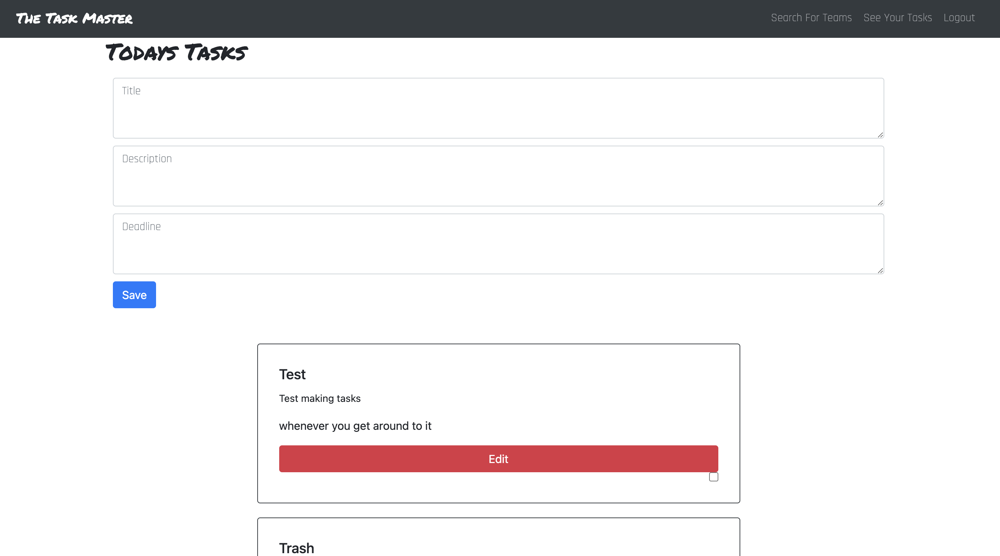

# the_task_master

## Table of Contents
- [Description](#description)
- [Installation](#installation)
- [Usage](#usage)
- [Contributing](#contributing)
- [Testing](#testing)
- [License](#license)
- [Questions](#userName)

## Description
This application will allow the user to keep track of any important tasks that they need to accomplish. 

## Installation
Make sure that after copying the repo, you run npm install to get all of the necessary npm packages. After npm has been properly run, use the command "npm run develop" to launch the application.

## Usage
This application is used for tracking any tasks the user may need help remembering.

## Contributing
Cory Carroll, Taylor Terril, and Marshall Jacob.

## Testing

## links
GitHub: https://github.com/MarshallJacob/the_task_master
 
Deployed Application: https://the-task-master-3000.herokuapp.com/

## License
Academic
University of Utah
 
 
### If you have any questions you can find us through
 
Github:
 
[MarshallJacob](https://github.com/MarshallJacob)
 
[CoryCarroll](https://github.com/CoryCarroll)
 
[TaylorTerrill](https://github.com/taylorterrill)

